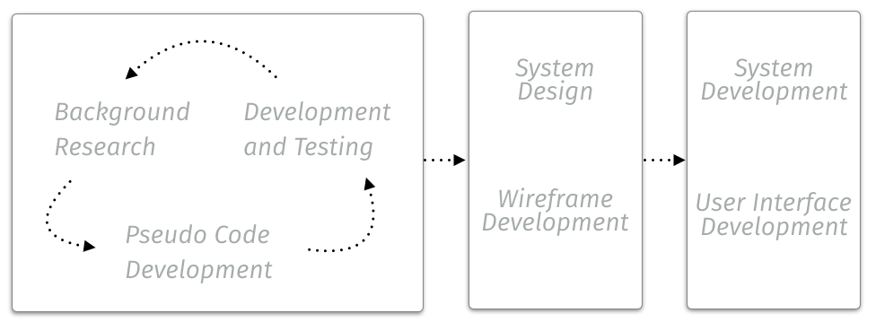

## 1.3 Methodology.

Due to the nature and scale of this project it has not been possible to adopt a traditional waterfall methodology of collecting requirements and defining a specification before progressing to development.

Development of this project requires small iterations of: Research, Design, Implementation and Testing.

TODO SOMETHING ABOUT AGILE!

This practice will provide: -

A short feedback loop allowing for a more adaptive process. - Modular development of functionality allowing for extendibility or expansion.

An adaptive process is required as some image processing, analysis, and object recognition techniques are better suited to the the requirements of this project then others. Although initial research has been carried out to assume suitability of techniques, due to the high level of data contained within images and variety of sometimes random information received during the capture of digital images, testing and feedback may show poor suitability. In which case alternative methods will need to be sought.

Once the suitable collection of processing, analysis, recognition, and letterform construction tools has been finalised, a final system design can be actioned coupling together technologies and the user interface.

### 1.3.1 Analysis and Design.

As noted in as the start of this section development of this project will follow the short cycle of:
- Background research,
- Pseudo code development,
- Implementation and testing.

Background research into techniques has been performed to determine suitability of image processing and analysis techniques. Where suitability is assumed correct formula and expressions provided are deconstructed into pseudo code before being implemented, tested, and analysed.

### 1.3.2 System Design.

Once the function of the system is complete the requirement will be to pull each tool set together and integrate into the User Interface. UML will provide the description of the system.

Unified Modeling Language (UML) will provide a significant tool set during the analysis and design stage. UML offers documented standards allowing for a common language throughout the industry. As a result of standardisation and industry strength, supporting documentation for the use of UML is in abundance.

### 1.3.3 System Implementation.

The final application of this project will be developed for installation on Mac OS X.

The default language of choice for OS X is Objective-C supported by the Cocoa Framework. The use of Objective-C and Cocoa will ensure this application will be native to the environment and be performant due to being a language and framework optimised for the system the application will run on.

In addition the Cocoa framework provides the Core Image interface potentially aiding the the Image Processing aspect with the functionality that Core Image provides in addition providing GPU rending if required.

Being a strict superset of the C programming language, Objective-C provides lower level control over memory management that could be important when dealing with resource hungry operations involved with image processing and analysis.

Development of the source code and UI will be undertaken within Xcode 7 development environment.

### 1.3.4 System Testing.

Unit testing will provide assurances during development where applicable.

TODO UPDATE!

