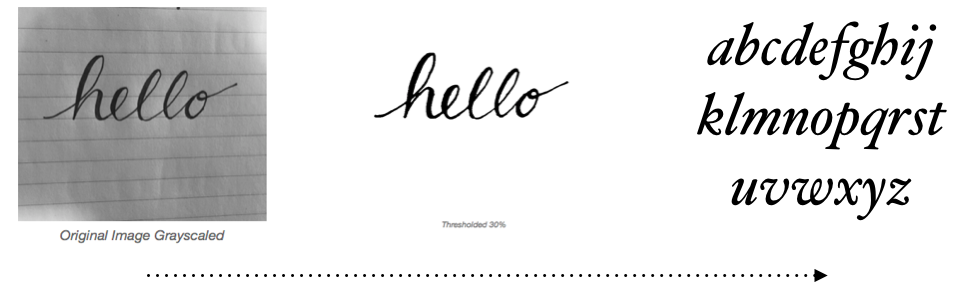

# 1. Introduction.

Personal computers provide users with multiple ways in which to create and share documents. Be it the writing of letters or emails, creation of presentations, and designing for print or the web. Each of these activities involve the use of one core element - typography. A building block of which is the typeface.

The creation of documents for the majority of users will be provided via the use of word processors, presentation tools, email clients and graphic design tools. These types applications all provide a limited set of of typefaces available to allow the user to personalise and distinguish their documents from that of others. Although the web provides services to buy and install fonts, these can be expensive, geared toward the professional graphic designer or web designer, and with near endless choice a time consuming venture.

The process of designing and implementing a typeface has a high bar for entry, takes many hours to create and many more hours to master. Furthermore type development is not a skill available to all, despite artistic ability or intent. This fact takes the potential for complete personal and visual expression away from even the most creative users.

Although tools do exist that remove an element of the required skill set, these range from the higher skill level in the case of fontself, through a template manipulation web tool called prototypo, to the lower end my-script-font. (see Comparable Systems). Despite the quality of these tools they fail to provide both a lower bar of entry and representative, personalised output.

The intention of this project is to design and implement an application that will lower the bar for typeface font creation taking the essence of a persons handwritten text in order to provide personalised and expressive fonts for the use of document creation.

Through the analysis of handwritten letterforms provided by the user in the form of a bitmap image, these images will be processed in order to remove noise, colour, and unwanted none-letterform artefacts/objects of the provided bitmap. On removal of unwanted data from the bitmap, this will be thresholded to produce a binary representation of the letterforms. It is then the intention to create a tool set of techniques in order to identify features of the handwritten letterforms such as: x- height, ascender and descender length, crossbar heights, counter size and shape, cursive exit and entry heights, and letter widths.

Information gleaned from the letterform analysis will then be applied to letterform templates to be transformed and translated to represent features of the input handwritten text.

