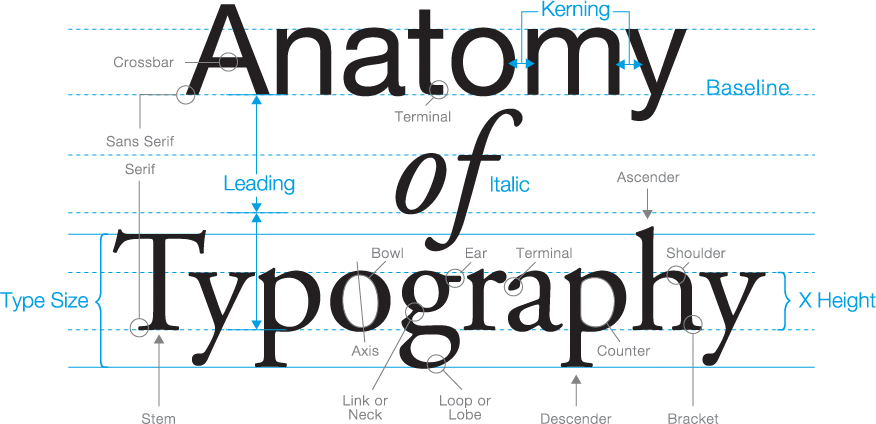

## 2.1 Background Reading.

Reading and research into the application to be implemented in this project will largely be undertaken iteratively as required. Sources have been gathered preemptively to ensure availability and allowing for timely and reactive cross reference. The following resources have been gathered:

##### Image Processing.

- Digital Image Processing - (Gonzalez and Woods, 2002)
- Digital Image Processing - (Castleman, 1995)
-  Principles of digital image processing: Fundamental techniques - (Burger and Burge, 2014a)
-  Principles of digital image processing: Core Algorthms - (Burger and Burge, 2014b)
-  Principles of digital image processing: Advanced Methods - (Burger and Burge, 2014c)

##### Typography and Type design.

- Counterpunch - (Smeijers, 1996)
- Stop Stealing Sheep & find out how type works - (Spiekermann, 2013)
- The Geometry of Type - (Coles and Spiekermann, 2013)

### 2.1.1 Initial Research.

Initial background reading has been undertaken in order to understand the collection of image processing tools that will be required to start the implementation of this project. The core resource of this background reading has been Digital Image Processing (Gonzalez and Woods, 2002).

Through quick inquiry into this resource the following applicable chapters and sections have been singled out for deeper analysis along with the construction of figure 3 highlighting tool sets required for research and development in order to achieve the required letter form features. Figure 4 provides reference of typeface attributes detailed. 

- 2 Digital Image Fundamentals.
    - 2.5 Some Basic Relationships Between Pixels.
- 3 Image Enhancement in the spatial Domain.
    - 3.3 Histogram Processing.
    - 3.6 Smoothing Spatial Filters.
    - 3.7 Sharpening Spatial Filters.
- 9 Morphological Image Processing.
    - 9.2 Dilation and Erosion.
    - 9.3 Opening and Closing.
- 10 Image Segmentation.
    - 10.1 Detection of Discontinuities.
    - 10.3 Thresholding
    - 10.5 Segmentation by Morphological Watersheds.
- 12 Object Recognition.
    - 12.2 Recognition Based on Decision-Theoretic Methods.
    - 12.3 Structural Methods.

