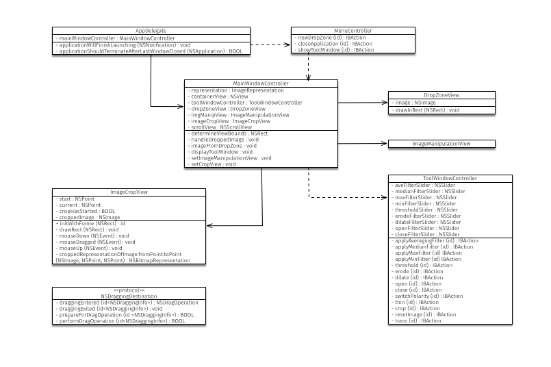

## 3. System Design.

### 3.1 Initial System Design.

As this project does not follow a traditional software development methodology requiring research and experimentation during development a full system design cannot yet be determined.

However, to ensure control over the system architecture is maintained the following simple rules and guidelines have been determined.

1. Maintain a separation of Model, View, and Controller concerns.
2. Group concerns. Therefore, Image Processing methods will share a class, Image Analysis methods will share a class.
3. Where a concern forms its own group within a concern, this will create its own class. e.g. Morphology is an image processing toolkit, however presents a large sub set to make its own class.
4. Where a documented algorithm has been used this will create its own class. i.e. Thinning can be described as a Morphological process, however should many thinning algorithms be implemented the Morphology class would contain many "thin" methods. Therefore, each thinning algorithm would instead follow a thinning protocol. (Protocols are ~equivalent to interfaces in Java, therefore if this where a Java application, each thinning algorithm would implement a thinning interface).

### 3.2 Final System Design.

Figure . documents the implementation of the user interface stating the dependencies realised by the `MainWindowController`. The `MainWindowController` deals with the presentation of state dependent views as its primary concern.

Figure . details the implementation of the `ToolWindowController`. The primary function of the `ToolWindowController` is taking user action and calling the relevant processes.

A UML Sequence Diagram has been constructed documenting the interaction between classes when dealing with user interaction. Figure .

Cocoa provides the `NSNotificationCenter` classes allowing for the sending of messages between classes (Apple, 2009). Use of this functionality has been observed in the design of this system to remove hard dependencies between window and view objects.

Equivalent to an implementation the Observer Design Pattern (Gamma et al., 1995), `NSNotificationCentre` provides the interface to create observers to be notified as a reaction to an event. For the system design observers set in `MainWindowController` are notified by `DropZoneView`, `ImageCropView`, and `ToolWindowController` as a result of user action. When notified of an event `MainWindowController` can act on the event. Significant to the design of this system, the implementation of observers means the three notifying classes do not need to maintain reference to `MainWindowController` removing dependencies between the classes. Therefore, should changes be made and the `MainWindowController` is replaced by a different controller the notifying classes are not required to change.

