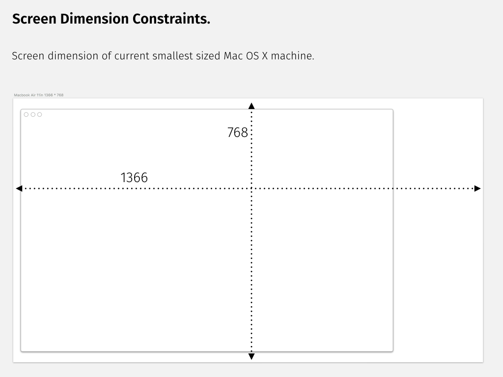

## 4. Interface Design.

Initial interface designs have been completed in order to determine the look, feel, layout and minor interaction details required for users to complete the creation of their typeface.

### 4.1 Screen Dimension Constraints.

Prior to the creation of detailed wire-frames the screen size constraints have been determined. Early versions of this application will be targeted towards MAC OSX, therefore to ensure all users from the range of Apples OSX devices the screen size of the smallest device, 11in Macbook Air, have been applied as the base constraint. All subsequent designs will therefore be required to fit these boundaries. The constraint values have been provided by Sketch.app (Bohemian Coding, 2016) which will generate a predefined "Artboard".

### 4.2 Image Upload.

The primary method of subject image upload will be through dropping an image onto the application window, simplifying the process. However, generally the interaction of drag and drop is favorable when items are dropped from the desktop or a least the viewable screen. Therefore, alternatives should been included. As Figure . there use of a Finder dialog has been considered. In addition future versions of this application could offer iCloud support allowing from the taking of picture for an iCould supported device and sent to the desktop application.

Implementation of the drag and drop interface would require the display of feed back to the user in the event an incorrect format is provided. In the case of a Finder dialog, the available list of formats would be reduced down to only the applicable formats.

### 4.3 Image Processing tools.

Due to the wide variety of image quality that maybe provided to the application, user interaction may be required during the Image Processing phases. Although the intension is to limit the required user interaction by programmatically fixing the image quality, as of version one of this application some interaction maybe required. Where values are required by the system, Slider controls would be used to alter the values pasted to the various image processing implementations.

### 4.4 Output presentation.

Once processing of an image is complete, displaying final forms to the user will allow for comparison and in future versions the ability for the user to grade output opening the possibility of a systems that learns.

### 4.5 Saving output.

Two possibilities for the saving and installation of font files has been considered.

1) Simply allow the user to save the file using a Finder Dialog. Figure .
2) A multi stepped process guiding the user through: naming a font, specifying fonts formats to generate, selection of licenses for sharing of the output typeface, and whether to install and/or download the files. Figure .

For version one of this application the intention is to simply provide an SVG output, therefore option one would be acceptable.

### 4.6 UI Storyboard.

Figure . details the a high level view of the full process required of for user interaction

