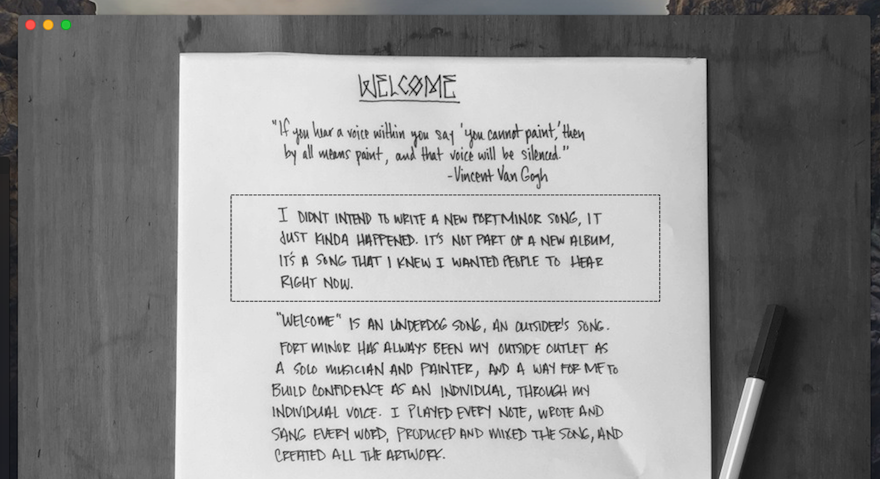

## 5.1 Image Data Acquisition.

### 5.1.1 Using Cocoa to retrieve the image data.

In order to facilitate the extraction of image data into a processable format of manipulation, the Cocoa framework provides the `NSBitmapImageRep` class with the `- initWithBitmapDataPlanes:pixelsWide:pixelsHigh:bitsPerSample:samplesPerPixel:hasAlpha:isPlanar:colorSpaceName:bitmapFormat:bytesPerRow:bitsPerPixel:` method.

As colour data is not required for the any produced output the `bitsPerSample`, and `bitsPerPixel` will be provided with only 8 bits, with the `samplesPerPixel` limited to 1. This limits the data to a 0 - 255 range of grey level values. 

https://developer.apple.com/library/mac/documentation/Cocoa/Conceptual/CocoaDrawingGuide/Images/Images.html#//apple_ref/doc/uid/TP40003290-CH208-BCIBBFGJ

(Apple, 2009) Cocoa Drawing guide presents the `NSGraphicsContext` class as a method of drawing an image to a newly created bitmap representation. 

This has allowed of the creation of a gray scale representation, to which the acquired image is drawn (Figure 18).

<figure>

```

    // ...
    NSString* file = [@"~/path/to/image.png" stringByExpandingTildeInPath];
    NSImage* image = [[NSImage alloc] initByReferencingFile:file];

    // ImageRepresentation.m
    NSBitmapImageRep *representation = [[NSBitmapImageRep alloc]
                                        initWithBitmapDataPlanes: NULL
                                        pixelsWide: image.size.width
                                        pixelsHigh: image.size.height
                                        bitsPerSample: 8
                                        samplesPerPixel: 1
                                        hasAlpha: NO
                                        isPlanar: NO
                                        colorSpaceName: NSCalibratedWhiteColorSpace
                                        bytesPerRow: image.size.width
                                        bitsPerPixel: 8];
    
    NSGraphicsContext *context = [NSGraphicsContext graphicsContextWithBitmapImageRep:representation];
    [NSGraphicsContext saveGraphicsState];
    [NSGraphicsContext setCurrentContext:context];

        [image drawAtPoint:NSZeroPoint
                  fromRect:NSZeroRect
                 operation:NSCompositeCopy
                  fraction:1.0];

    [context flushGraphics];
    [NSGraphicsContext restoreGraphicsState];
    
    unsigned char* data = [representation bitmapData];


```

<figcaption>Figure 18: Image Acquisition</figcaption>
</figure>


### 5.1.2 Image Crop Functionality.

The addition of cropping functionality will:
1. Reduce the size of the representation requiring processing, therefore improving performance.
2. Reduce the variety of data that is required to be processed ensuring only relevant detail is analysed.
3. Allow the user to specify the exact regions of text for analysis.

A major trade off of adding the crop functionality is a lesser requirement for user interaction upon aspects of the image processing phase that could be considered advanced ability or knowledge requirement.

As an example, the following representation provided by the user contains: two varying regions of handwritten text a) and b), a region of texture resulting from the wooden table in the background c).



Using the thresholding of the image as an example, the wide range of grey level values of the representation creates difficultly when trying to determine an optimal threshold value that will maintain a strong representation of the required data (the handwritten element of the supplied image) and remove unwanted data. This could potentially require the user to specify the threshold value.

As cropping functionality is common in popular applications such as: Microsoft Word or PowerPoint, and Photoshop, cropping of images likely already within a users knowledge, whereas thresholding functions would not be common an potentially difficult for the user to understand. In addition, a cropping function provides the further benefit by allowing the user more control over the selection of text in images where variance in handwriting style is apparent as in Figure 19.

