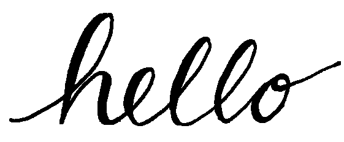
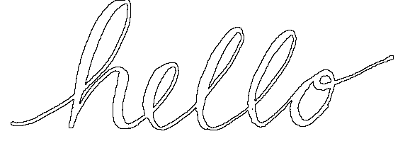
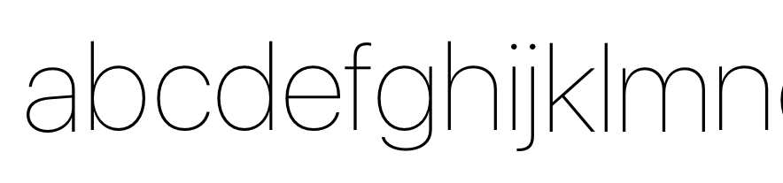
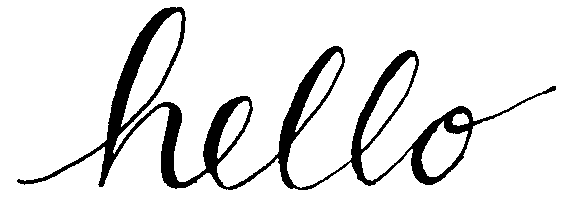

### 5.2.4 Morphology.

*Morphology is the process of changing the shape of objects of the image.*

(...)

The application of morphological operations on provided subjects will create a toolkit for:

- re-connecting broken stokes in the subject.
    + Performed by dilation, or growing the object.
- removing data for the purpose of analysis.
    + Performed by erosion, shrinking of the object.

As displayed in figure ... the image provided contains thin lines that when thresholded to a certain degree will disconnect from the object. Should tracing [5.3.1.1] be applied to this subject with the intention of capturing border information from the subject potentially vital information could be overlooked.  


By applying a combination of a Max filter and a dilation operation it is possible to connect the objects.


To enable the possibility to analyse the direction and/or degree of a letterform subject's slant, removing the detail of the lines with thinner contrast by eroding the subject may provide a reasonable environment for analysis as shown in figure ...


As with the application of smoothing filters[5.2.3] implementation of two selected morphological operations, erosion and dilation, a structuring element representing a neighborhood of pixels will be used. The structuring element for will be a binary representation. As described by the following:

$$ H(i, j) \in {0, 1} $$

So, the structure H(i, j) is a member of the set {0, 1}

(Burger and Burge, 2014)

#### 5.2.4.2 Dilation.

(Gonzalez and Woods, 2002, p. 524) describes the dilation of an image as: 

> The dilation of $A$ by $B$ then is the set of all displacements $z$, such that $A$ and $B$ overlap by at least one element.

Here B is the structuring element with A being the subject. The displacement $z$ is the current position x, y in in the representation. 

Therefore, where a structuring element built around a defined point _hits_ or makes a connection to a foreground pixel, the defined point (centre pixel in this implementation) is set to a foreground pixel. 


##### Pseudo Code.

As with the smoothing filters [5.2.3] implemented each pixel of the representation is evaluated, an offset or padding around the centre of the structuring element is defined in order to visit each offset of the structuring element. Where any element of the 


```

padding = (size - 1) / 2.0

foreground = black
background = white

for y, x pixels in image

    for each offset from current x, y
            
        if input subject at offset == foreground
            output subject at centre of structuring element = foreground
        else 
            output subject at centre of structuring element = background


    

```


##### Implementation.

Taking a thresholded image and creating two representation, an original for inspection and another for the output, iterate over each pixel. At each pixel visit each pixel in the offset and determine if the offset is of the foreground or background. Where a foreground pixel is found a *hit* is recorded and foreground is later applied to the centre point. Should there be no foreground pixels under the offset position the centre is set to the background.

```objc

// created representations of the original and output

int padding = (size - 1) / 2.0;

background = 0; // black
foreground = 255; // white

// for y, x

    for (int s = -padding; s < (padding + 1); s++) {
        for (int t = -padding; t < (padding + 1); t++) {
            
            int index = (x + s) + ((y + t) * width);
            
            if ( original[index] == foreground )
            {
                hits = YES;
            }
        }
    }

    processed[centre] = background;
    if ( hits )
    {
        processed[centre] = foreground;
    }

```

##### Result of dilation.




#### 5.2.4.1 Erosion.

> The white shapes make the background and the black shapes make the foreground. The background makes the foreground and the other way around. Change one and you change the other too.

(Smeijers, 1996)

Therefore, while dilation is used to increase the foreground by the structuring element (effectively decreasing the back), erosion can be the mater of increasing the background by the structuring element. Al that is required is to reverse the inquiry target and the value that will be set at centre

```

padding = (size - 1) / 2.0

foreground = white
background = black

for y, x pixels in image
    for each offset from current x, y
            
        if input subject at offset == foreground
            output subject at centre of structuring element = foreground
        else 
            output subject at centre of structuring element = background

```

This allows for the creation of a method that can do both dilation and erosion by simply supplying the background and foreground values as parameters.

```objc

- (NSBitmapImageRep*) simpleDilationOfImage:(NSImage*)image
                      withNeighbourhoodSize:(int)size
{
    return [self processImage:image 
               withBackground:255 
                andForeground:0 
         andNeighbourhoodSize:size];
}


- (NSBitmapImageRep*) simpleErosionOfImage:(NSImage*)image
                     withNeighbourhoodSize:(int)size
{
    return [self processImage:image 
               withBackground:0 
                andForeground:255 
         andNeighbourhoodSize:size];
}

- (NSBitmapImageRep*) processImage:(NSImage *)image
                    withBackground:(int)background
                     andForeground:(int)foreground
              andNeighbourhoodSize:(int)size
{

 // as with dilation figure ...

}


```

##### Result of erosion.


#### 5.2.4.3 Opening and closing.

Opening operations is provide the function of Smoothing contours and eliminating small islands and sharp peaks. While Closing operations, smooths contours and fuses narrow breaks.

The equations for Erosion and Dilation are as follows.

- Erosion: $A\oplus B=\left\{ { z }|{ {  \left( \hat { B }  \right) }_{ z } } \cap A\neq \emptyset \right\}$
- Dilation: $A\ominus B=\left\{ { z }|{ { \left( { B } \right)  }_{ z } }\subseteq A \right\}$


And the equations for opening an closing:

- Opening: $A\circ B=(A\ominus B)\oplus B$
- Closing: $A\bullet B=(A\oplus B)\ominus B$

Therefore, Opening is the application of Dilation followed by Erosion and Closing is Erosion followed by Dilation.

(Gonzalez and Woods, 2002, p. 528)

The implementation of these tools simply requires the calling of one method after the other.

##### Opening Implementation

```objc

- (NSBitmapImageRep*) openingOnImage:(NSImage*)image
               withNeighbourhoodSize:(int)size
{
    NSImage* temp = [[NSImage alloc] initWithSize:image.size];
    NSBitmapImageRep* eroded = [self simpleErosionOfImage:image
                                    withNeighbourhoodSize:size];

    temp = [ImageRepresentation cacheImageFromRepresentation:eroded];
    NSBitmapImageRep* dilated = [self simpleDilationOfImage:temp
                                      withNeighbourhoodSize:size];
    return dilated;
}

```

##### Result of Opening.


The result of opening show that the remaining object are smoother that the result of using erosion alone.


##### Closing Implementation.

```objc

- (NSBitmapImageRep*) closingOnImage:(NSImage*)image
               withNeighbourhoodSize:(int)size
{
    NSImage* temp = [[NSImage alloc] initWithSize:image.size];
    NSBitmapImageRep* dilated = [self simpleDilationOfImage:image
                                      withNeighbourhoodSize:size];

    temp = [ImageRepresentation cacheImageFromRepresentation:dilated];
    NSBitmapImageRep* eroded = [self simpleErosionOfImage:temp
                                    withNeighbourhoodSize:size];
    return eroded;
}

```


##### Closing Result.


The result of Closing showing the strengthening of join points.

#### 5.2.4.5 Attaining Borders.

Retrieving the border of a subject is possible by taking two subjects and eroding or dilating one of the subject before subtracting one image from the other.

(Gonzalez and Woods, 2002, p. 528)

Alternatively using a tracing algorithm. [5.3.1.1]

##### Implementation.

```objc

- (NSBitmapImageRep*) imageDifferenceOf:(NSImage*)image1
                                    and:(NSImage*)image2
{
    NSImage* outputImage = [[NSImage alloc] initWithSize:image1.size];
    
    NSBitmapImageRep* rep1 = [ImageRepresentation grayScaleRepresentationOfImage:image1];
    NSBitmapImageRep* rep2 = [ImageRepresentation grayScaleRepresentationOfImage:image2];
    NSBitmapImageRep* output = [ImageRepresentation grayScaleRepresentationOfImage:outputImage];
 
    unsigned char *one = [rep1 bitmapData];
    unsigned char *two = [rep2 bitmapData];
    unsigned char *three = [output bitmapData];
    
    int width = image1.size.width;
    int height = image1.size.height;
    
    for ( int y = 0; y < height; y++ )
    {
        for (int x = 0; x < width; x++)
        {
            int index = x + (y * width);
            three[index] = one[index] - two[index];
        }
    }

    return output;
}

```

##### Result.


The result can then be negated to return the foreground and background colours to normal.



```objc

- (NSBitmapImageRep*) imageNegativeOf:(NSImage*)image
{
    NSBitmapImageRep* output = [ImageRepresentation grayScaleRepresentationOfImage:image];
    
    unsigned char* rep = [output bitmapData];
    
    int width = image.size.width;
    int height = image.size.height;
    
    for ( int y = 0; y < height; y++ )
    {
        for ( int x = 0; x < width; x++ )
        {
            int index = x + (y * width);
            
            int val = rep[index] - 255;
            
            if ( val < 0 )
            {
                val = val * -1;
            }
            
            rep[index] = val;
        }
    }
    return output;
}


```

#### 5.2.4.6 Thinning.

##### Purpose.

Thinning of the representation will provide data for both the construction of the letterform template, and the recognition of letter slant, cursive connections, and counter shape, patterns.

##### Background.

Thinning is the iterative erosion of a connected set down to a single pixel thickness without splitting the structure. (Burger and Burge, 2014)

Application of a thinning algorithm over a provided image will therefore preserve the required strucuture of the letterform representation, while removing features that are not required, such as contrast. In addition reducing the amount of data required to be processed.

Prior to thinning the representation will need to be thresholded to replecate a binary image.

(Lam, Lee, and Suen, 1992) provides explanation of two varying types of thinning algorithms, seqential and parallel.

> In a sequential algorithm, the pixels are examined for deletion in a fixed sequence in each iteration, and the deletion of *p* in the *nth* iteration depends on all the operations that have been performed so far.

Implementation of a sequential algorithm requires recording of each preceding operation, marking pixels for deletion on a given condition. At the end of an iteration marked pixels are scrutinized futher before removal.
(Lam, Lee, and Suen, 1992)

> In a parallel algorithm, the deletion of pixels in the *nth* would only depend on the result that remains after the (*n* - 1)th; thefefore, all pixels can be examined independently in a parallel manner each iteration.  

Parallel thinning algorithms pixels are removed during each iteration and therefore only act upon the image data left by the last iteration.

Due to performance concerns with the requirement to maintain reference to pixels marked or "flagged" for deletion in the implementation of a sequential thinning algorithm, a parallel thinning approuched will be used in the initial implementation of this project. 

The Zhang Suen thinning algorithm has been examined due to favorable processing speed, simplicity of computations required, and high level of documentation.

<figure>

| Pattern | Four-Step | Two-Step | Zhang Suen |
|:-|:-|:-|:-|
| B | 0.765 | 0.678 | 0.454 |
| Moving body | 2.713 | 2.221 | 1.163 |

<figcation>Comparison of CPU time (in seconds) Consumed by Different Parallel Thinning Algorithms. (Zhang and Suen, 1984)</figcation>
</figure>

##### 5.2.4.6.1 Zhang Suen Thinning algorithm.

The goal of the Zhang Suen algorithm is to remove all contour points and preserve the structure of the pattern. The deletion of each pixel depends on it self and that of its 8 adjecent / connected neighbours and is split into two subiterations in order to maintain structure.

Zhang Suen define the following conditions for each iteration.

a) ${ 2 } \le B({ P }_{ 1 }) \le { 6 }$

The sum of the 8 (nonzero/black) neighbours of ${P}_{1}$ which are structure pixels is greater then or equal to 2 and less than or equal to 6.  

b) $A({P}_{1}) = 1$

Of the ordered set ${P}_{2}$, ${P}_{3}$, ${P}_{4}$ ... ${P}_{8}$, the sum of each 0 to 1 patterns found equals 1. Therefore in the pattern from ${P}_{2}$ to ${P}_{8}$ (0, 1, 0, 1, 0, 0, 0, 1) there are three 01 patterns and so ${P}_{1}$ would not be removed.

c) ${P}_{2} \times {P}_{4} \times {P}_{6} = 0$
d) ${P}_{4} \times {P}_{6} \times {P}_{8} = 0$

Or, one of ${P}_{2}$, ${P}_{4}$, or ${P}_{6}$ is equal to 0 (white) and one of ${P}_{4}$, ${P}_{6}$, or ${P}_{8}$ is equal to 0 (white).  

Where all of these conditions are true, the pixel at the centre of the neighbourhood ${P}_{1}$ is removed, or in the case of this application set to white.

Steps a) and b) are repeated in the second iteration, however c) and d) are changed:

c) ${P}_{2} \times {P}_{4} \times {P}_{8} = 0$
d) ${P}_{2} \times {P}_{6} \times {P}_{8} = 0$

(Zhang and Suen, 1984)

The followning pesudo code has been developed from (Zhang and Suen, 1984) algorithm detailed.

<figure>
    
```

while changes are still being made.
    do subiteration 1
    do subiteration 2    

```
<figcaption>
    Outer Loop.
</figcaption>
</figure>

<figure>
    
```

foreach pixel x, y

    if pixel(x, y) != black
        skip all other conditions.

    // a)
    if pixel(p2) == black, a++
    ...
    if pixel(p9) == black, a++
    conditionA = 2 <= a <= 6


    // b)
    if pixel(p2) == white and pixel(p3) == black, b++
    ...
    if pixel(p9) == white and pixel(p2) == black, b++
    conditionB = (b == 1)

    // c) 
    conditionC (p2 == white or p4 == white or p6 == white)

    // d)
    conditionD (p4 == white or p6 == white or p8 == white)

    if conditionA and conditionB and conditionC and conditionD
        set pixel x, y to white
        change made.

```
<figcaption>
    Sub Iteration 1
</figcaption></figure>


<figure>
```

// as with sub iteration 1

    // c) 
    conditionC (p2 == white or p4 == white or p6 == white)

    // d)
    conditionD (p2 == white or p6 == white or p8 == white)

    if conditionA and conditionB and conditionC and conditionD
        set pixel x, y to white
        change made.

```
<figcaption>
    Sub Iteration 2
</figcaption>
</figure>


##### Result.

<div class="hide">
    TODO: IMPLEMENTATION APPENDIX REFERENCE
</div>

Implementation and testing of the Zhang Suen thinning algorithm detailed in their paper (Zhang and Suen, 1984) shows that stems or thin structrues of letterforms are removed completly with vital data is lost.



As shown below the stem of b, d h, i, j in this small sample has been removed.


The inaccuracies in (Zhang and Suen, 1984) have be detailed in (Chen and Hsu, 1988) showing that condition a) does not preserve all end points of structures. As discussed by Chen, and Hsu altering condition a) to  ${ 2 } \le B({ P }_{ 1 }) \le { 6 }$ resolves this problem.


However, this change will effect different representations in varying ways. Whereas with the thinned typeface detailed above and the structure degraded, applying the original a) condition to a handwritten letterform and the same degradation is not observerd.

Application with the amended condition on the same image shows a high level of trailing artifacts.





