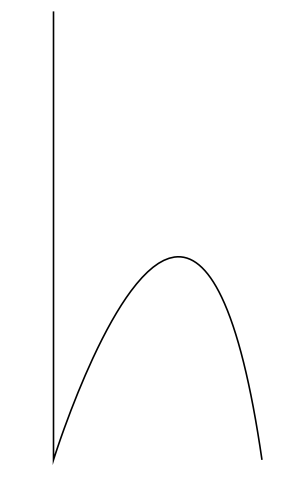

## 5.3 Letterform template.

Due to handwritten text being unstructured and lacking in uniformity with entire words sometimes being made up of single lines and letterspacing ... 

TODO: REFERENCE CounterPunch.. AND WRITE INTRODUCTION IN ENGLISH!

To ensure that the output represents a balanced and legible set of characters when constructed, data gleaned from the input samples, such as the x-height, cap-height, and slant, will be applied to a template of characters. This template of letterforms can then be translated / manipulated to the specification provided by extracted attributes of the handwritten text.

The application of manipulating the template requires that:
- The template be in a vector format allowing for points to be adjusted rather then individual pixels.
- points of the letterform template are required to be relational / relative measures ensuring the balance is maintained throughout each character of the template and the subsequent output.
- Relative measures will need to be applied to the global letter set to account for the requirement of letter width and kerning to be of a consistent balance.

Due to the importance of the letter width and kerning on the presentation of a... the template will be based on a professionally developed typeface.

This presents two possible methods of creating a template
1. Use a graphics editing vector pen tool to trace each character of the chosen typeface.
2. Use the Morphology / thinning algorithms adopted in order to reduce the chosen typeface to a single pixel width set. This set can then be scrutinised using point operations and extracted point by point.
3. Access the chosen fonts "font table" and extract point data.


TODO: STATE REASON FOR CHOSING OPTION 2.


### 5.3.1 Letter form point extraction.

#### 5.3.1.1 Theory / Hypothesis / Considerations.

... iterate over pixels.
... find a black pixel.
... trace the pixel moving to each point and querying surrounding pixels.
... reduce data by eliminating redundant points.

... considerations.
    ... crosses / joins.
    ... re tracing collected points.
    ... what to do at end points.
    ... do I need to know the character.


#### 5.3.1.2

```
// finding the first pixel.

for each pixel x, y
    
    if pixel(x, y) is black.

        // Start the trace.
        trace(x, y)


```

```
// The trace.
// favor the next pixel in the current direction.

points = [];
trajectory = -y | +y | ....

trace(x, y)

    if next pixel is black
        move to next pixel and collect.
    else
        look at 4 adjacency pixels N4(p)
        // if going down direction 
        // go left/right then up
        // then 8 adjacency pixels N8(p)


```

#### 5.3.1.3 ...

.. first us a simple drawn example to test theory.
.. then apply to a geometric sans font.
.. then apply to a script font.




