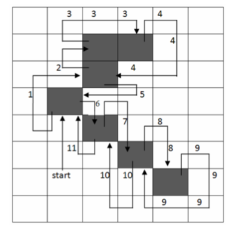
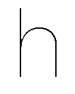
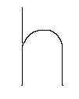
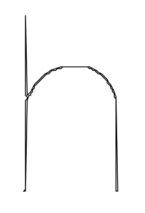
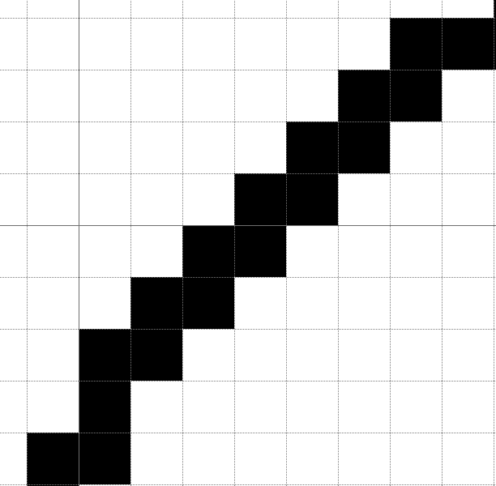
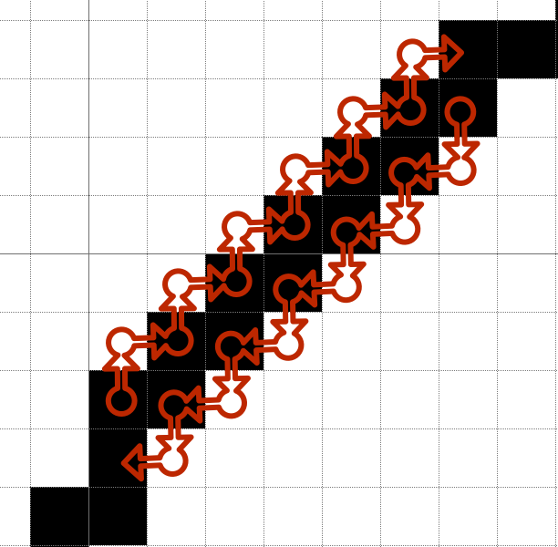

## 5.3 Letterform template.

Due to handwritten text being unstructured and lacking in uniformity with entire words sometimes being made up of single lines and letterspacing ... 

TODO: REFERENCE CounterPunch.. AND WRITE INTRODUCTION IN ENGLISH!

To ensure that the output represents a balanced and legible set of characters when constructed, data gleaned from the input samples, such as the x-height, cap-height, and slant, will be applied to a template of characters. This template of letterforms can then be translated / manipulated to the specification provided by extracted attributes of the handwritten text.

The application of manipulating the template requires that:
- The template be in a vector format allowing for points to be adjusted rather then individual pixels.
- points of the letterform template are required to be relational / relative measures ensuring the balance is maintained throughout each character of the template and the subsequent output.
- Relative measures will need to be applied to the global letter set to account for the requirement of letter width and kerning to be of a consistent balance.

Due to the importance of the letter width and kerning on the presentation of a... the template will be based on a professionally developed typeface.

This presents two possible methods of creating a template
1. Use a graphics editing vector pen tool to trace each character of the chosen typeface.
2. Use the Morphology / thinning algorithms adopted in order to reduce the chosen typeface to a single pixel width set. This set can then be scrutinised using point operations and extracted point by point.
3. Use a border tracing algorithm of a none thinned letter set.
4. Access the chosen fonts "font table" and extract point data.


TODO: STATE REASON FOR TRYING 2 AND 3.


### 5.3.1 Letter form point extraction.

#### 5.3.1.1 Contor and Line Tracing.

Moore-neighbour, Square tracing, Pavlidis algorithm, radial sweep.

Moore-neighbour, and Square tracing will ignore holes, however as the current requirement is to trace the contours of a skeletonised representation of letterforms the shape of inner holes will be equaivalent to the outer shape.

The square tracing algorithm will fail to to trace an 8-connected strucutres that isnt 4 connected.

Both the moore-neighbour and the square tracing algorithms follow the same princible actions:

1. Find the start point.
2. Trace the contour of the image.
3. Stop at a given condition.

Where these algorithms differ is in action 2. 

##### Moore-neigbour Algorithm.

The Moore-neighbour algorithm named as such due to its use of the Moore neighbourhood being the 8 connected neighbours (p1, p2 ..., p8) around a point (p0).

<figure>

```
    p1  p2 p3
    p8  p0 p4
    p7  p6 p5
```

<figcaption>Figure 78: Moore Neighborhood</figcaption>
</figure>

As a highlevel representation of the algorithm the follow presents the key steps as provided by the full algorithm in figure 79.

<figure>
    
1. Iterate of the binary image until a black pixel is found.
2. Store the start pixel for later reference to be involved in the stopping criteria.
3. Set the start pixel as centre of Moore neighborhood
4. Go back to the pixel previous to the start pixel was found.
5. Move in a clockwise(or anticlockwise) direction around the centre pixel of the neighborhood considering each pixel.
6. Should the considered pixel be the start pixel, conciser exiting the procedure.
7. Where the considered pixel is black, make this the centre pixel and set the considered pixel to the previously considered pixel.
8. repeat 4.

<figcaption>
    Figure 79: Moore Neighbor Algorithm interpretation
</figcaption>
</figure>

Figure shows the 8 neighbours of p0 are ordered p1, p2, ..., p8 and represents the order in which concidered pixels around p0 are visited.



(Rajashekar Reddy, Amarnadh, and Bhaskar, 2012) details the following algorithm.

<figure>

```

Input: A square tessellation, T, containing a connected component P of black cells. 
Output: A sequence B (b 1 , b 2 ,..., b k ) of boundary pixels i.e. the contour. 

Define (a) to be the Moore neighborhood of pixel a. 
Let p denote the current boundary pixel. 
Let c denote the current pixel under consideration i.e. c is in M (p).

Begin 
Set B to be empty.

From bottom to top and left to right scan the cells of T until a black pixel, s, of P is found.

    Insert s in B. 
    Set the current boundary point p to s i.e. p=s 
    Backtrack i.e. move to the pixel from which s was entered. 

    Set c to be the next clockwise pixel in M(p). 
        While c not equal to s 
        do 
            If c is black
                insert c in B
                set p=c
                backtrack (move the current pixel c to the pixel from which p was entered)
            else
             advance the current pixel c to the next clockwise pixel in M(p) 
        end while 
End

```
<figure>Figure 81: Moore’s Neighbor tracing algorithm</figure>
</figure>

From this algorithm the following pesudo code has been developed.

<figure>

```
// Moore Neighourhood Offsets.
Offsets[] = {(-1,1), (0,1),  (1,1),
             (-1,0), (0,0),  (1,0) 
             (-1,-1),(0,-1), (1,-1)}

traced = [];

for each pixel x, y
    if pixel == black
        matched? = yes
        start = pixel
        traced[0] = start
    else
        last = pixel

    if matched? exit loop

center = start
concideration = last
concideration offset = last - start.

while stopping critria has not be met
    if concideration is black
        traced add concideration
        center = concideration
        concideration = current + next offset.
    else
        backtrack = concideration
        concideration = current + next offset.

```
<figure>Figure 81: Moore Neighbor Pseudo Code</figure>
</figure>

###### Implementation.

The first part of the implementation of this algrithm represents step 1 and 2 detailed in table: 

As with spatial filtered developed and detailed on 5.2, a representation is made from the provided subject. Each pixel of the representation is suritinized in order to find the first black pixel, the coordinates of which are stored. At each unsuccessful pass, reference is maintained to the last unsuccessful pixel match, this will determine the first backtrack poistion.

<figure>

```

- (NSArray*) mooreNeighborContourTraceOfImage:(NSImage*)image
{
    /* get the bitmap data from image representation. */
    
    int width = image.size.width;
    int height = image.size.height;
    int searchPixel = 0; // to find black pixels.
    BOOL match = NO;
    int x = 0, y = 0;

    NSPoint start, last;
    NSMutableArray* points = [[NSMutableArray alloc] init];
    
    for (y = 0; y < height; y++ )
    {
        for (x = 0; x < width; x++ )
        {
            index = x + y * width;
            
            if ( data[index] == searchPixel )
            {
                match = YES;
                start = NSMakePoint(x, y);
                NSValue *p = [NSValue valueWithPoint:start];
                [points addObject:p];
                break;
            } else {
                last = NSMakePoint(x, y);
            }
            
        }
        if ( match ) break;
    }

```
<figure>Figure 82: Moore Neighbor Implementation.</figure>
</figure>

Once the first black pixels has been found, the starting values for the trace are determined. The `backtrackOffset` is calculated as the difference between the matched pixel and the last successful pixel and is used to find the current position in the p1, p2, p3, ..., p8 offset order, this will determine the next offset around p0 that will be strutinised. Here step 3 and 4 of table: are represented.

<figure>

```
    int next = 0;
    NSPoint offsets[] = {NSMakePoint(-1, -1),
                         NSMakePoint(-1, 0),
                         NSMakePoint(-1, 1),
                         NSMakePoint(0, 1),
                         NSMakePoint(1, 1),
                         NSMakePoint(1, 0),
                         NSMakePoint(1, -1),
                         NSMakePoint(0, -1)};
    
    NSPoint current = start;
    NSPoint consider = last;
    NSPoint backtrackPosition = last;
    NSPoint backtrackOffset = NSMakePoint(last.x - start.x, last.y - start.y);
    
    // find the position 
    for ( int i = 0; i < 8; i++ )
    {
        if ( CGPointEqualToPoint(backtrackOffset, offsets[i]) )
        {
            next = i;
        }
    }
```
<figcaption>Figure 83: Moore Neighbor Implementation Continued</figcaption>
</figure>

The trace will now begin and continue until the stopping criteria is met, representing steps 4 and 5.

At each successful match of a black pixel the points of the pixel are collected. Although duplicate points are not wanted for the purpose of creating the letterform template, rather then query the collection at each successful match, the collection will be reduced to a ordered set before being return. Collecting each point regardless of duplication also ensures the order in which pixels are collected will be maintained, this will be an important factor when reducing the collected points from a set of pixel coordinates to bezier curves.

<figure>

```
    BOOL run = YES;
    while ( run )
    {
        index = consider.x + consider.y * width;
        
        if ( data[index] == searchPixel )
        {
            // stopping critria
            if ( CGPointEqualToPoint(start, consider) )
            {
                run = NO;
                break;
            }
            
            // collect the point.
            NSValue *val = [[NSValue alloc] init];
            val = [NSValue valueWithPoint:consider];
            [points addObject:val];

            // reset the center
            current = consider;
            backtrackOffset = NSMakePoint(backtrackPosition.x - current.x, backtrackPosition.y - current.y);
            
            // find the offset for the backtrack position
            for ( int i = 0; i < 8; i++ )
            {
                if ( CGPointEqualToPoint(backtrackOffset, offsets[i]) )
                {
                    next = i;
                    break;
                }
            }
            consider = NSMakePoint(current.x + offsets[next].x, current.y + offsets[next].y);
        } else {
            // store the last position to concider
            backtrackPosition = consider;

            // move to the next offset
            next++;
            if ( next == 8 ) next = 0;
            consider = NSMakePoint(current.x + offsets[next].x, current.y + offsets[next].y);
        }
    }

```
<figcaption>Figure 84: Moore Neighbor Trace Loop Implementation</figcaption>
</figure>

In order to remove duplicate values `[NSOrderedSet orderedSetWithArray:points]` provides unique values while maintaining order. 

<figure>

```objc

    NSOrderedSet* set = [NSOrderedSet orderedSetWithArray:points];
    NSArray* distinctPoints = [set array];
    
    return distinctPoints;
```
<figcaption>Figure 85: Reducing to distinct points.</figcaption>
</figure>

###### Result.

To test the result of this implementation a subject letterform from the typeface set that will be the basis of the letterform template is thresholded in order to remove alising. The subject is then thinned using the Zhang Suen algorithm to reduce the subject representation down to a single pixel width.





The data produced from the trace has been drawn to the screen point by point using the `NSBezierPath` class of the Cocoa framework in order to understand the success of the trace.



As shown in figure 88 although the application of the tracing algorithms has correctly traced the thinned subject, the result has not been as desired. As stated ... the desired was to produce a single line representation of the subject, this would then be used as a template from manipulation. However, due to failure to fully consider the results produced by the thinning of the original thresholded subject and data collected from the trace. As clearly displayed in figure TODO, the structure supplied by the thinning operation where curves and diagonal lines make up the structure these are joined by a two pixel thickness.



 Therefore, the tracing of along one side of the structure and then the other side of the structure would not meet on duplicate points, meaning both sets of points would be maintained after removal of duplicate points.

 


