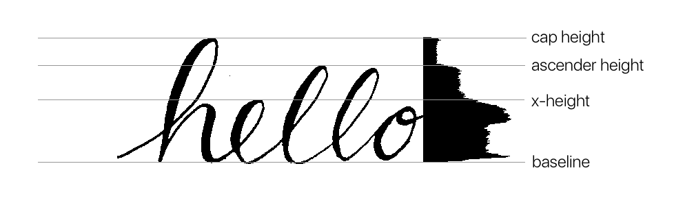

## 5.4 Image Segmentation and Analysis


With the subject clear of noise and non-text objects and then thresholded steps need to be take in order to segment the subject into lines and individual words. This will then create the basis for establishing the key required letter form attributes, cap-height, ascender height, and x-height. 

### 5.4.1 Line segmentation.

In order to achieve the segmentation of lines of handwritten text, a method of "Projection-profile" has been attempted.

(Likforman-Sulem, Zahour, and Taconet, 2006) define the projection profile file as simply:

> summing pixel values along the horizontal axis for each y value.

Therefore:

##### Pseudo Code.

<figure>

```

for each row y

    set the counter to zero

    for each column x 

        if pixel x, y is black.
            count++

    row(y) = count

```
<figcaption>Figure 91: Projection profile pseudo code</figcaption>
</figure>


##### Implementation.

<figure>

```objc

// create representation from image.


// create an array to capture values.
int* output = malloc(sizeof(int) * height);

// For each row
for ( int y = 0; y < height; y++ )
{
    int count = 0;

    // for each column
    for ( int x = 0; x < width; x++ )
    {
        int index = x + (y * width);

        // count each black pixel
        int t = input[index];
        if ( t == 0 )
        {
            count++;
        }
    }
    
    // at the end of the row cache the result.
    output[y] = count;
}


```
<figcaption>Figure 92: Projection profile Implementation </figcaption>
</figure>


##### Result.

Result of projection profile has successfully provided the positions at which lines of text start and stop along the y-axis.


However, the above subject represents a clear separation between lines, largely due to each letter form being uppercase and therefore absent of descender strokes.

Applying the same method to a letter set of mixed case, overlapping has occurred and the separation less clear. In such a case an alternative method will need to be found.


The use of projection profile of the purpose of analysis could however prove to be of worth. As displayed in Figure ... and even Figure ...  it is possible to recognise the various points of change occur relative to the attributes sought.




