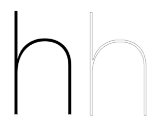

## 6. Evaluation.

The implemented features have been evaluated, determining their success as an implementation and as part of this project. Following feature evaluation, the project is evaluated from a software engineering perceptive.

### 6.1 Feature Evaluation.

#### 6.1.1 Cropping Images.

The cropping of images in order to remove non-text elements or textual elements that where unwanted has been successful. Although, in later versions if this application it is possible that non textual areas, such as the background table (Figure: 96), could possibly be removed programmatically, allowing the user to specify areas of text to analysis would remain. In addition, the cropping functionality implementation allowed for progress in other areas of the project that would otherwise have been held up by evaluating the removal of non text areas.


#### 6.1.2 Noise Removal Features and thresholding.

Although the implementation of spatial filter for the purpose of noise removal has been reasonably successful, due to that subject matter of handwritten text being dark colours on light backgrounds, the removal of noise is a minor issue when a subject will be thresholded. 


With each of the examples of subject and the filters implemented (Figure: 98) and then thresholded to the same value (Figure: 99) from this limited set it is possible to see that output presenting the fewest artifact is the thresholded subject image, followed by the median filter (with the median filter showing artifact elsewhere [5.2.3.1.3]). Therefore, it may have been possible to forgo the the implementation of filters. 


#### 6.1.3 Morphology.

As with [6.1.2], the implementation of morphological operations has been successful, applying the operations to the subject image has shown minimal benefit over thresholding for creating a cleaner representation to work with. 


However, taking a broken subject (Figure: 101) and applying a dilation operation, broken lines are connected, and missing data in the object is filled


##### 6.1.3.1 Thinning.

The requirement for thinning of the subject came from the desire to created a skeleton letterform template programmatically in addition would possibly have allowed for the analysis of curves and connections in the subject letter forms.

The results of applying the ZhangSuen algorithm to the subject where not as successful as initial hoped (Figure: 103) presenting both "Parasitic elements" and line distortion around the high contrast strokes of the subject.

The "Parasitic elements" presented  could be remedied through the implementation of "Pruning" operations (Gonzalez and Woods, 2002, p.545), however, the distorted lines/shapes such as the entry to the "o" character and the join at the entry of the "h" would need to be straightened to present a more ideal representation of the subject.


#### 6.1.4 Letterform Composition.

Two possible methods of creating a letterform template on which extracted attributes would be applied:

1. Programmatically extract forms from an available typeface.
2. Create the template by attaining point information from PaintCode.app (PixelCut, 2016) 

PaintCode.app will take an SVG sample and generate the points presented in Objective-c code (Figure: 104)

Despite access to this application, the decision was made to apply method 1 and create the template by implementing a tracing algorithm in order to extract the paths of a bitmap representation of a typeface.

<figure>
```objc
  // Generated by PaintCode.App

    NSBezierPath* hPath = [NSBezierPath bezierPath];
    [hPath moveToPoint: NSMakePoint(0.06, 0)];
    [hPath lineToPoint: NSMakePoint(1.59, 0)];
    [hPath lineToPoint: NSMakePoint(1.59, 20.16)];
    [hPath curveToPoint: NSMakePoint(13.41, 32.69) 
          controlPoint1: NSMakePoint(1.59, 27.53) 
          controlPoint2: NSMakePoint(6.5, 32.69)];
    [hPath curveToPoint: NSMakePoint(24.47, 21.66) 
          controlPoint1: NSMakePoint(19.97, 32.69) 
          controlPoint2: NSMakePoint(24.47, 28.5)];
    [hPath lineToPoint: NSMakePoint(24.47, 0)];
    [hPath lineToPoint: NSMakePoint(26, 0)];
    [hPath lineToPoint: NSMakePoint(26, 21.72)];
    [hPath curveToPoint: NSMakePoint(13.59, 34.12) 
          controlPoint1: NSMakePoint(26, 29.25) 
          controlPoint2: NSMakePoint(20.97, 34.12)];
    [hPath curveToPoint: NSMakePoint(1.66, 25.69) 
          controlPoint1: NSMakePoint(7.75, 34.12) 
          controlPoint2: NSMakePoint(3.09, 30.66)];
    [hPath lineToPoint: NSMakePoint(1.59, 25.69)];
    [hPath lineToPoint: NSMakePoint(1.59, 47.06)];
    [hPath lineToPoint: NSMakePoint(0.06, 47.06)];
    [hPath lineToPoint: NSMakePoint(0.06, 0)];
    [hPath closePath];
    [hPath setMiterLimit: 4];
    [hPath setWindingRule: NSEvenOddWindingRule];
    [fillColor setFill];
    [hPath fill];

```
<figcaption>Figure 104: Path Generated By PaintCode</figcaption>
</figure>

##### 6.1.4.1 Contour tracing.

The use of a contour tracing algorithm [5.3.1.1] presented three issues in the creation of the template.

1. Inner shapes of character would be ignored.
2. Incorrect assumptions where made about the structure of a thinned representation [5.3.1.1].
3. Assigning control points at which attributes, extracted during analysis, would be applied to the template. 

Despite these issues, the implementation of the Moore Neighbor algorithm was successful. Therefore, this was a specification failure due to not correctly understanding or evaluating the problem, rather then application of the algorithm.




#### 6.1.5 Image Analysis.

Due to time constraints and the lack of a letterform template, only minimal analysis has been achieved.

##### 6.1.5.1 Projection Profile.

Projection profile provides a simple method of extracting four key letterform attributes: Cap-height, x-height, ascender height, descender length. However, the effectiveness of this method is yet to be fully determined as the results have not yet been fully analysed.


### 6.2 Project Evaluation.

The inability to establish an output typeface from this implementation is due to failures in the project in three areas.

#### 6.2.1 Project Failures.

##### 1. Delay in establishing the methodology for research and development.

In the initial stages of this project attempts where made to understand the application of image processing in a detailed form. However, this had lead to an over abundance of information being consumed, therefore creating: a) bewilderment and excess noise, b) time spent learning tools that where not required, c) difficulty establishing the correct path of action, and d) difficultly understanding how the operations being researched would be translated to code.

This has meant development of the project began at a later then planned stage.

Only once development of the simpler operations such a spatial filters had began, did the correct methodology cycle of research, development, implementation, become clear. This methodology was then carried throughout the rest on the project.

##### 2. The incorrect order of research focus.

At an early stage, this project was broken down into 4 key sub components, Image Processing and analysis, Letterform Composition, Generated output, UI Development. Although breaking down the problem into these areas was correct, initial planning decided that the order of development would follow that of the order of operations within the system to complete the required task. This order being:

1. Image Pre-processing.
2. Image Analysis.
3. Template Creation.
4. Letterform Composition.
5. Generated Output

With UI Development being implemented in tandem.

In addition to establishing this order it was also determined that this would be a linear process of implementing 1-5 in order.

Both the order of implementation and the linear movement through the sub components lead to:

1. Being the first component, image pre-processing became the core focus of research.
2. Slow movement through the components.

Although a large part of this project would have had to be devoted to Image Processing. As discovered at a late stage and noted in this evaluation, the application of smoothing filters seems largely unneeded due to the subject mater and the effectiveness of even a global threshold function.

Ideally, the real focus should have been on Image Analysis and referencing image pre-processing techniques when required as well as a larger onus being have also been placed on the template creation component.

Therefore a non-liner approach with a greater focus on Image analysis was required.

##### 3. Inability to correctly establish the problem prior to implementation of some features.

In addition to notes about the requirement for smoothing filters, the effectiveness of a Moore neighbor tracing algorithm on a thinned items as a basis for the letterform template had been grossly mis-assumed. Although smoothing filters could still prove of worth to this project with the introduction of a wider verity of subject image quality, the application of the tracing algorithm for template creation displays a failure to simply analyse the pixel structure of a thinned image. [5.3.1.1]

Implementation of these features where time consuming and therefore reduced available time that could have been applied elsewhere. 

#### 6.2.2 Project Successes.

Despite falling short of any generated output, each of the tools created are performant and achieve their own goals as required. Therefore, these are all successes in their own right and will provide application in future implementations.

The development of the demonstration UI provides a simple mechanism for apply the created tools to a supplied image. (Figure: 109)


