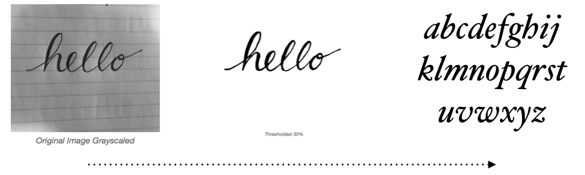

footer: JAMES MITCHELL - 10425907 - Towards the development of Image processing and analysis techniques to influence creation of structured typefaces from handwritten text images.
slidenumbers: false

### *Towards the development of*

### Image processing *and* analysis techniques *to* influence creation *of* structured typefaces *from* handwritten text images.

---

#### Introduction.

---

> Written letters can be used only during the process of writing its self: the moment of production and use are one and the same.
> -- Fred Smeijers 

[^Smeijers, 1996]

[^Smeijers, 1996]: Counterpunch: Making type in the sixteenth century, designing typefaces now. United Kingdom: Chronicle Books.

---


---

### [fit] The process of designing a typeface has a high bar for entry
### [fit] taking many hours to create 
### [fit] and many more hours to master.

---

### [fit] type development is not a skill available to all
### [fit] despite artistic ability or intent. 
### [fit] This fact takes the potential for complete personal and visual expression away from even the most creative users.

---

#### The Primary Objective

### Design *and* implement *an* application *that will* lower the bar *for the* average user *to* create typeface fonts *from* images *of* handwritten text.

---

## [fit] Desired function.



---

### [fit] Background

---

#### Methodology
#### [fit] Breaking down the problem.
#### [fit] Collection of resources.
#### [fit] Research, Development, Implementation.

---

#### Breaking down the problem

# [fit] Image Processing and analysis
# [fit] Letterform composition.
# [fit] Generating output.
# [fit] User interface Development.

---

#### Image Processing 

# [fit] Creating the right environment.

#### and analysis

# [fit] Finding the features

--- 

#### Letterform Composition

# [fit] Creation of a template.

# [fit] Applying Attributes.

---

#### Generating output

# [fit] SVG.

# [fit] TrueType.

# [fit] OpenType.

---

#### User interface development.

# [fit] Provide station for input.

# [fit] Options for output.

---

#### Collection of resources

# [fit] Handwritten subjects.

# [fit] Research materials.

---
#### Research Development and Implementation.

# [fit] Background Research
# [fit] Pseudo code development
# [fit] Implementation.

---

#### Research Development and Implementation.

### [fit] Image Processing
### [fit] and Analysis.

---


---

#### [fit] Research Development and Implementation.

# [fit] Thresholding.


---

# Thresholding.

## Finding the equation.

$$
g(x,y) = T[f(x,y)]
$$

$$
g(x,y)=\begin{cases} 1 & if\quad f(x,y)\quad >\quad T \\ 0 & if\quad f(x,y)\quad \le \quad T \end{cases}
$$

Gonzalez and Woods, 2002

---

###### RESEARCH, DEVELOPMENT AND IMPLEMENTATION

## Developing the pseudo code.

---

```
            T = threshold value

            for each row y in representation
                for each column x in row

                if pixel(x, y) > T then
                    pixel(x, y) greylevel = 1
                else 
                    pixel(x, y) greylevel = 0


```


---

###### RESEARCH, DEVELOPMENT AND IMPLEMENTATION
### [fit] Implementing.

---

```objc

- (NSBitmapImageRep *) thresholdWithValue:(int)value
{
   
   // get the image data 
    NSBitmapImageRep *output = [self grayScaleRepresentationOfImage:self.image;
    unsigned char *data = [output bitmapData];
 
    // ..  
} 

```

---

```objc

    // Iterate over the image.

    for ( int y = 0; y < self.height; y++ )
    {
        for ( int x = 0; x < self.width; x++ )
        {
            int index = x + (y * self.width);
            
            // ..

        }
    }
    
    return output;
}


```

---

```objc

            // apply the threshold
            if ( data[index] < value) {
                data[index] = 0;
            } else {
                data[index] = 255;
            }


```

---

# Demonstration.

---


# Critical Appraisal

---

## Concluding Recommendations.

